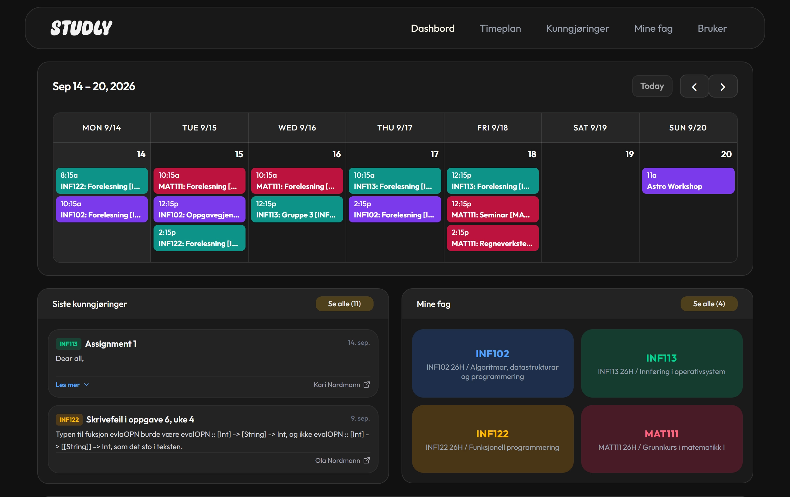
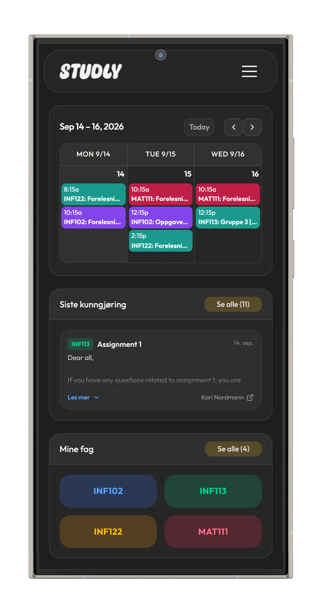

## Om prosjektet

Mange studenter opplever Canvas som rotete, og synes det er vanskelig å få med seg alt som blir lagt ut

**Studly** løser dette ved å samle alt i et dashbord:
- **Samlet kalender:** Se forelesninger og innleveringer i kalenderen.
- **Samlede kunngjøringer:** Les beskjeder på tvers av alle fagene.
- **Fagoversikt:** Få direkte tilgang til dine aktive emner.
- **Snarveier:** Ett klikk unna Studentweb, TP, Canvas og student-e-post.
- **Personvern:** Canvas API-nøkkelen lagres lokalt i egen nettleser og deles aldri.

---

## Skjermbilder

| PC-visning | Mobilvisning |
| :---: | :---: |
|  |  |

---

## Teknologistakk

### Frontend
- **Rammeverk:** [Next.js 16](https://nextjs.org/) (App Router, Server Components & Server Actions)
- **UI-bibliotek:** [React 19](https://react.dev/)
- **Styling:** [Tailwind CSS v4](https://tailwindcss.com/) & [shadcn/ui](https://ui.shadcn.com/)
- **Animasjoner:** [Framer Motion](https://www.framer.com/motion/)
- **Kalender:** [@fullcalendar/react](https://fullcalendar.io/) med iCalendar-plugin og [ical.js](https://github.com/kewisch/ical.js/)
- **Ikoner:** [Lucide React](https://lucide.dev/)
- **Sikkerhet:** [DOMPurify](https://github.com/cure53/DOMPurify) (HTML sanitering)
- **Autentisering:** [@react-oauth/google](https://www.npmjs.com/package/@react-oauth/google)

### Backend
- Kommuniserer med en **FastAPI**-backend (Python) for proxying mot Canvas REST API, kalenderstrømmer og brukerhåndtering

## Kjør lokalt

### Forutsetninger
- **Node.js**: v20.x eller nyere
- **npm** (eller pnpm / yarn / bun)
- Kjørende instans av **Studly Backend** (FastAPI)

### 1. Klon repositoriet
```bash
git clone https://github.com/jon-hoye/Studly-Frontend.git
cd Studly-Frontend
```

### 2. Installer avhengigheter
```bash
npm install
```

### 3. Konfigurer miljøvariabler
Opprett en `.env.local`-fil i rotmappen med URL-en til backend-serveren:
```env
NEXT_PUBLIC_API_URL=http://localhost:8000
```

### 4. Start utviklingsserveren
```bash
npm run dev
```

Åpne [http://localhost:3000](http://localhost:3000) i nettleseren din.

---

## Canvas API-nøkkel

For å koble Studly til dine egne fag og timeplaner:
1. Logg inn på Canvas for din institusjon (f.eks. [mitt.uib.no](https://mitt.uib.no)).
2. Gå til **Konto** ➔ **Innstillinger**.
3. Bla ned til **Godkjente integrasjoner** og klikk **+ Ny tilgangsnøkkel**.
4. Skriv et navn (f.eks. *Studly*) og generer nøkkelen.
5. Lim inn nøkkelen under brukerinnstillinger i Studly (`/bruker`).

---

## Personvern & Sikkerhet
- **Ingen passordlagring:** Innlogging skjer trygt via Google OAuth.
- **Lokal tokenlagring:** Canvas API-nøkkel lagres kun lokalt på enheten din i krypterte/sikre cookies.
